[comment]: # "This is the standard layout for the project, but you can clean this and use your own template"

# VisitLog

---

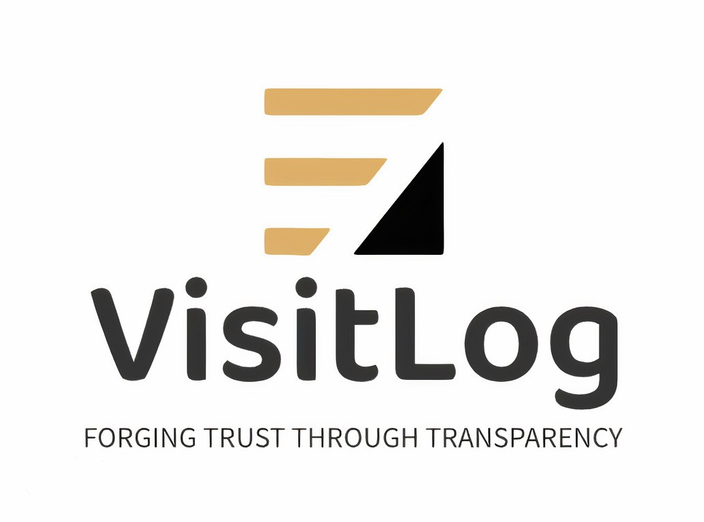
 

## Table of Contents
1. [Introduction](#introduction)
2. [Objective](#objective)
3. [Highlevel Solution Architecture](#highlevel-solution-architecture)
4. [Software Design](#software-design)
5. [Key Features](#key-features)
6. [Why Use Our Software](#why-use-our-software)
7. [Getting Started](#getting-started)
8. [Contact](#contact)
9. [Links](#links)

---

## Introduction

When Engineers or Technicians visit sites to provide technical services (such as repairs, troubleshooting, maintenance), a report should be filled by the visiting service provider and checked off by the service receiver to maintain accountability and transparency. The expectation of this project is to develop a simple, easy to use, robust software application for the above purpose. 

## Objective

The primary objective of this project is to create a simple yet powerful software tool that enables engineers, technicians, and service providers to seamlessly generate detailed reports while on-site, followed by verification and approval from the service recipients. By doing so, we aim to foster accountability, transparency, and open communication between service providers and receivers.

## Highlevel Solution Architecture
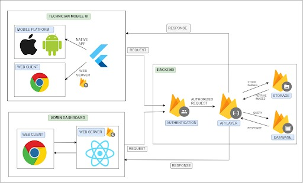

## Software Design

### User Interface for Technicians - Mobile Application

Mobile application mainly consists of;
    
1. Login Page
    * Managing User login with the email and the password.
    * User can choose preffered account for logging.
2. Profile Page
    * User can see the completed, ongoing and missed tasks.
3. Job Cards
    * In assiged task list page, user can see the all information about the task.
    * After doing the task, user can see the job done card.
4. Technician Form
    * User can fill this form instead of using a paper.
    * There is a digital signature ba also.
5. SideBar
    * User can navigate through pages using sidebar.
6. Logout Page
   
See the prototype of the mobile app interface [here](https://www.figma.com/proto/ZJFEjCkwhxeERxmkAQdxP1/VisitLog?type=design&node-id=7-2&t=Nw2wuyAjBMAtArIR-0&scaling=scale-down&page-id=0%3A1&starting-point-node-id=7%3A2)

**Wire frame Diagram for the Mobile
application**

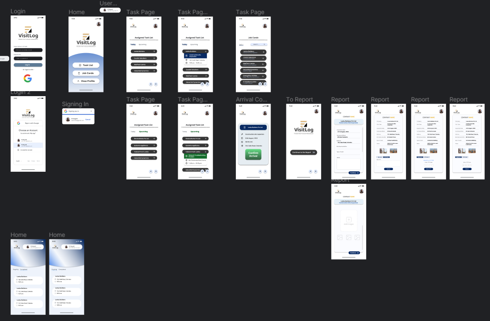

**Login Page (Implemented)**

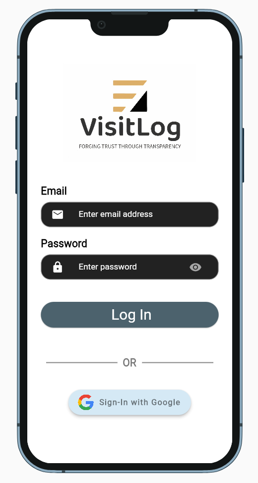

**Profile Page (Implemented)**

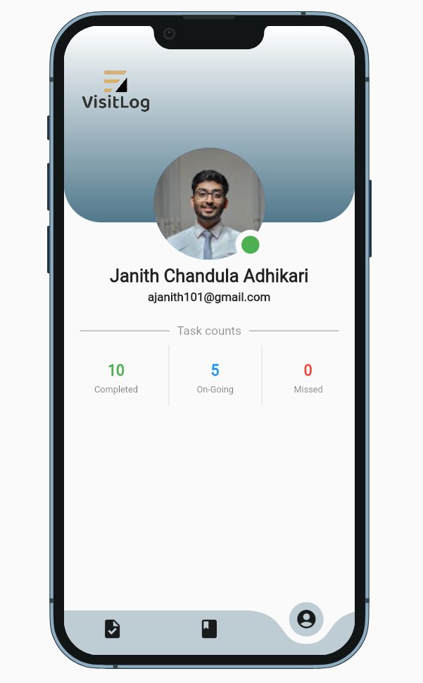

**Job Cards (Implemented)**

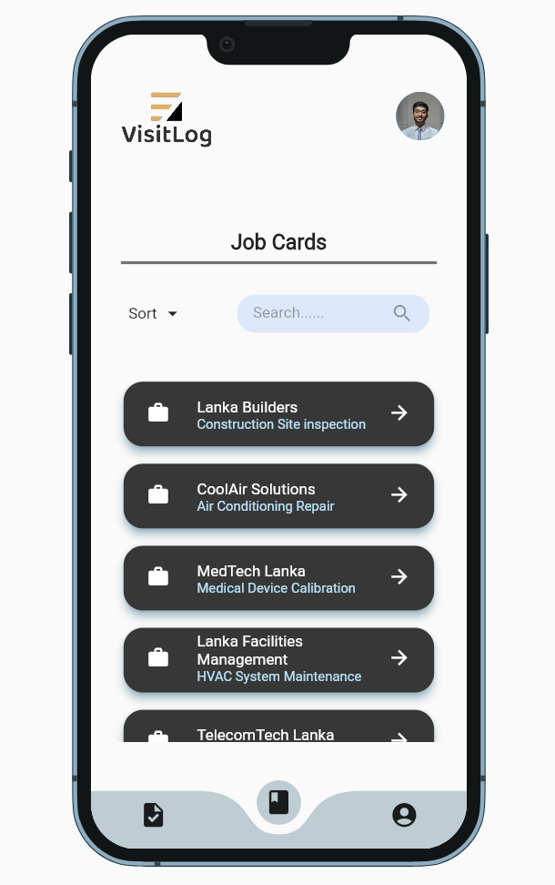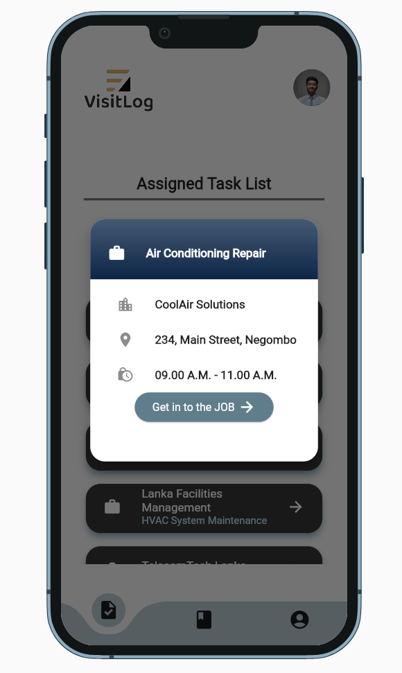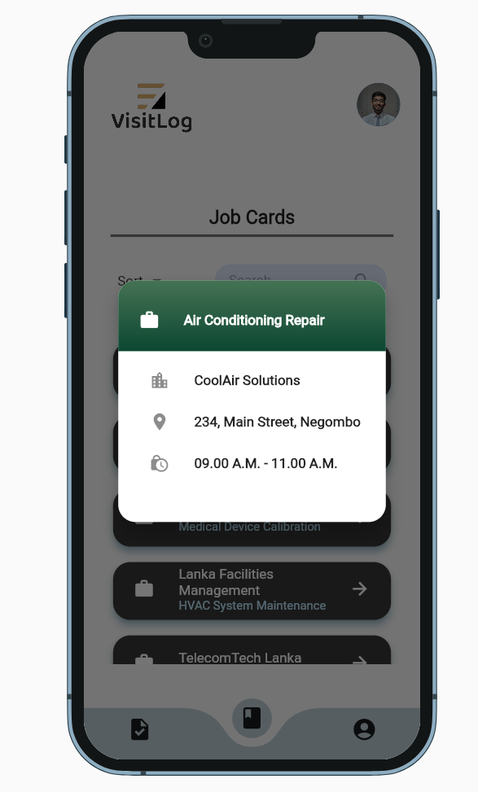

**Technician Form (Implemented)**

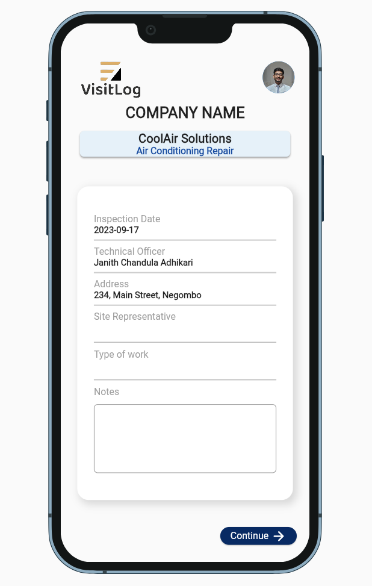

**Side Bar (Implemented)**

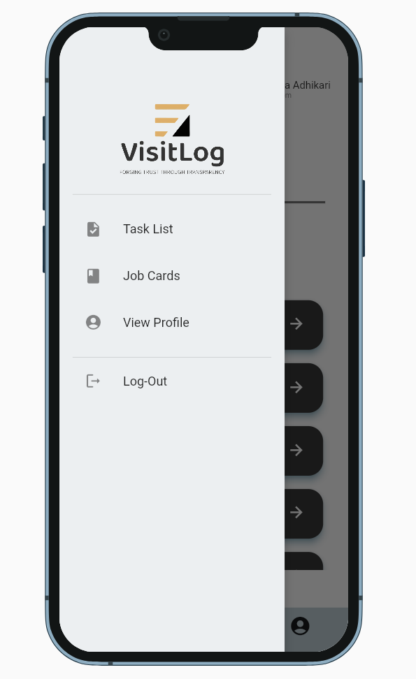

**Logout Page (Implemented)**

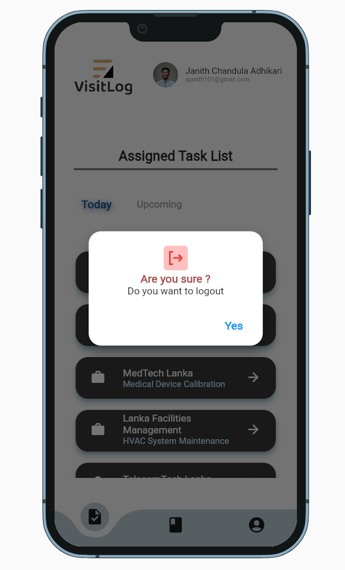

### User Interface for Administration - Web Application

Web application mainly consists of;
    
1. Login Page
    * Managing Admin login with the email and the password.
    * Or can sign in with google
    * Admin can choose preffered account for logging.
2. Dashboard Page
    * Admin can see the calender, ongoing tasks and completed tasks.
    * Admin can add clients, technicians and tasks here.
3. Clients Page
    * Can view all the clients.
    * Can add new clients.
    * Can search for specific clients.
4. Technicians Page
    * Can view all the technicians.
    * Can add new technicians.
    * Can search for specific technicians.
5. Tasks Page
    * Can view all the tasks.
    * Can add new tasks.
    * Can search for specific tasks.
6. Technician Assign Page
    * Can view all the assignments of tehcnicians with the time; today, upcoming and Previous.
7. Settings Page
    * Admin can edit their profile as well as technicians' profiles in settings page.
   
See the prototype of the Web app interface [here](https://www.figma.com/proto/uFw6wGwKTS4zzlWgCK6FuP/VisitLog---WebPage?type=design&node-id=4-162&t=MNVIIypJkiAslQQy-0&scaling=contain&page-id=0%3A1&starting-point-node-id=4%3A162)

**Wire frame Diagram for the Web
application**

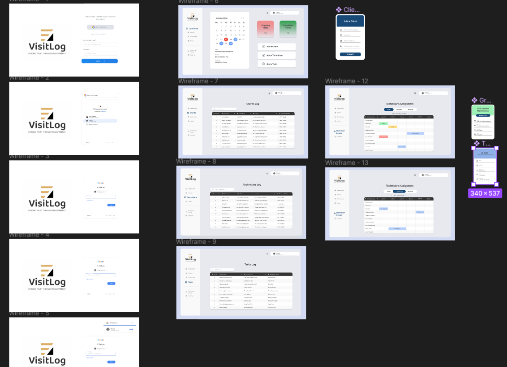

**Login Page (Implemented)**

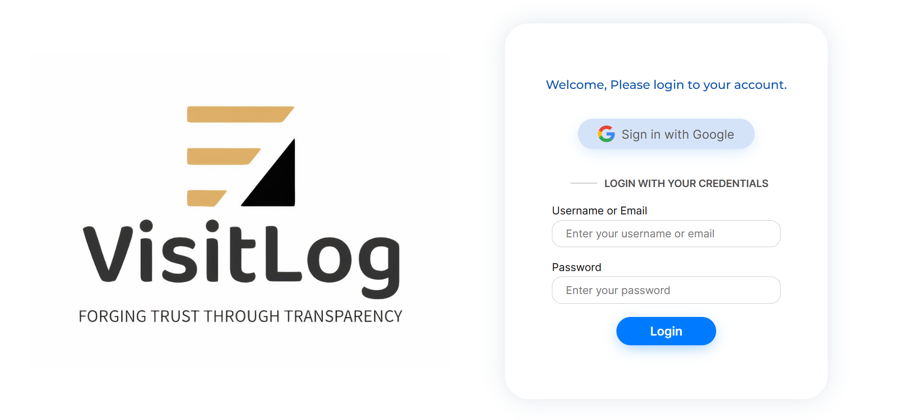

**Dashboard Page (Wireframe)**

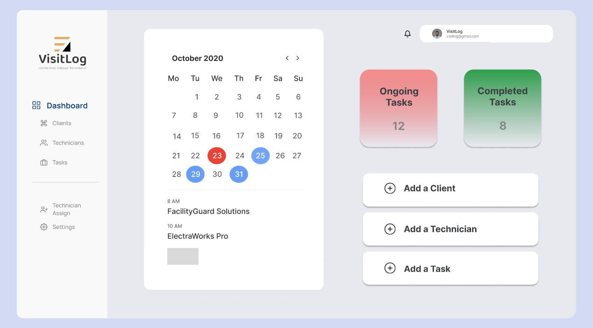

**Clients Page (Wireframe)**

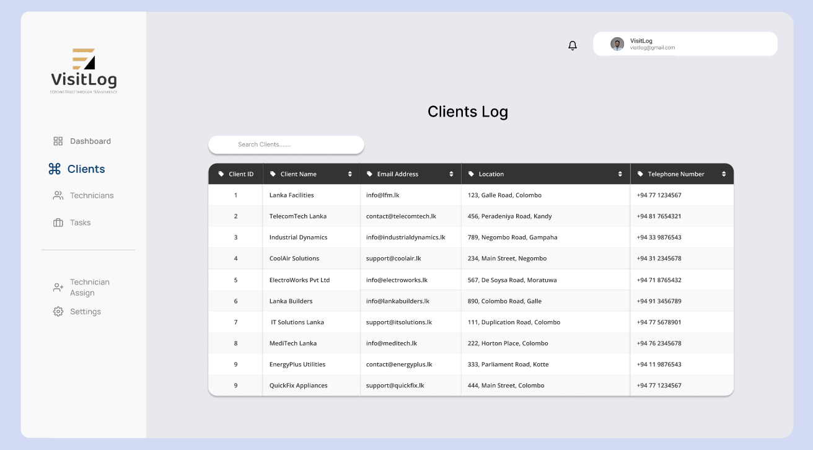

**Technicians Page (Implemented)**

**Tasks Page (Wireframe)**

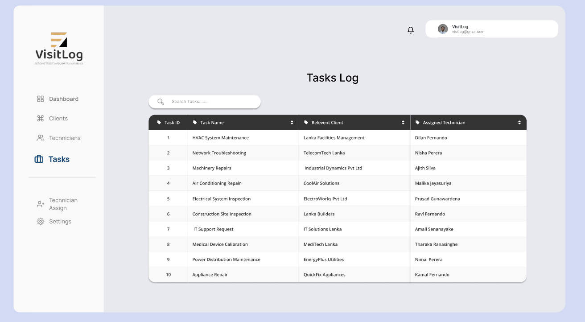

**Technician Assign Page (Wireframe)**

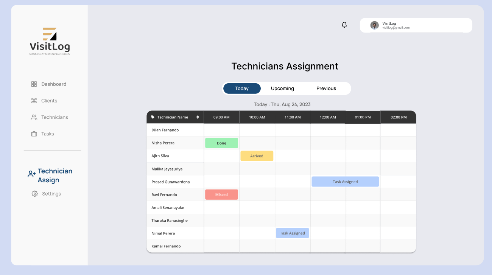

## Key Features

- **User-Friendly Interface:** Our software features an intuitive and easy-to-use interface that enables service providers to quickly enter relevant details during their site visits.

- **Real-time Reporting:** Service providers can create reports in real-time, capturing accurate and up-to-date information directly at the site.

- **Customizable Templates:** Different service scenarios often require different report formats. Our software offers customizable templates to cater to a variety of technical service requirements.

- **Digital Signatures:** The application supports digital signatures for both service providers and receivers, ensuring the authenticity and legal validity of the reports.

- **Approval Workflow:** After generating a report, the software initiates an approval workflow, allowing service receivers to review and either approve or request revisions.

- **Cloud Integration:** Reports are securely stored in the cloud, guaranteeing data accessibility, backup, and retrieval from anywhere at any time.

- **Reporting Analytics:** The software provides valuable insights into service trends, common issues, and time spent on various tasks, aiding organizations in optimizing service operations.

## Why Use Our Software

- **Efficiency:** Our application streamlines the report generation, sharing, and approval processes, saving time for both service providers and receivers.

- **Accountability:** With digital signatures and approval workflows, our software establishes a clear trail of responsibilities, ensuring accountability at every step.

- **Transparency:** Involving service receivers in the approval process fosters transparency and open communication between service providers and clients.

- **Insights:** The built-in analytics offer actionable insights that help organizations enhance service quality and efficiency over time.

## Getting Started

To get started with our software, please follow the installation and usage instructions provided in the [Documentation](/docs).

## Contact

For any questions, feedback, or collaborations, feel free to reach out to our project team.

## Team
-  E/19/008, Adhikari R.A.J.C., [email](mailto:e19008@eng.pdn.ac.lk)
-  E/19/009, Adhikari A.M.K.M., [email](mailto:e19009@eng.pdn.ac.lk)
-  E/19/063, Dassanayake D.M.G.S., [email](mailto:e19063@eng.pdn.ac.lk)
-  E/19/094, Mansitha Eashwara, [email](mailto:e19094@eng.pdn.ac.lk)
-  E/19/124, Hirushi Gunasekara, [email](mailto:e19124@eng.pdn.ac.lk)
-  E/19/129, Kanishka Gunawardena, [email](mailto:e19129@eng.pdn.ac.lk)
-  E/19/324, Rathnayake R.M.B.D.K., [email](mailto:e19324@eng.pdn.ac.lk)
-  E/19/372, Kaushitha Silva, [email](mailto:e19372@eng.pdn.ac.lk)
-  E/19/408, Sanduni Ubayasiri, [email](mailto:e19408@eng.pdn.ac.lk)

## Links

- [Project Repository](https://github.com/cepdnaclk/e19-co328-Digital-Reporting-of-Technical-Visits/tree/main)
- [Project Page](https://cepdnaclk.github.io/{{ page.repository-name}}){:target="_blank"}
- [Department of Computer Engineering](http://www.ce.pdn.ac.lk/)
- [University of Peradeniya](https://eng.pdn.ac.lk/)

[//]: # (Please refer this to learn more about Markdown syntax)
[//]: # (https://github.com/adam-p/markdown-here/wiki/Markdown-Cheatsheet)
